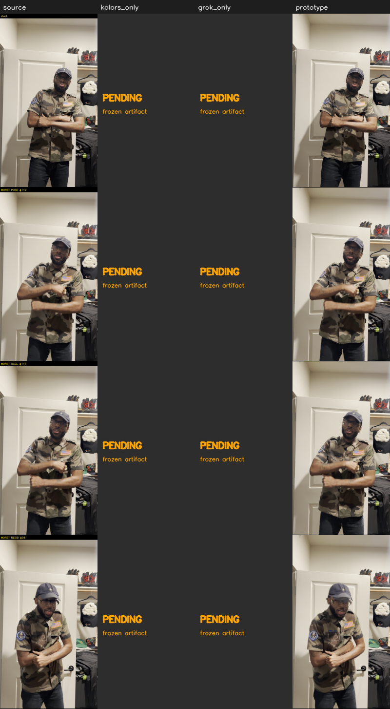

# One-shot REVIEW GATE — `oneshot_2s_arm_cross`

Full-clip evaluation of **all 120 frames** (no cherry-picking). Worst pose-change and worst hand-occlusion frames are called out explicitly and included in the side-by-side.

> **OUTCOME: CONDITIONAL PASS**

> **Isolated weakness / blocker:** Garment-detail transfer is UNPROVEN: the real Kolors base frames and Grok correction anchors (and SAM masks) are not yet wired — BLOCKED on the separate preflight/upload deploy. The flow/gate/composite/brand/status machinery is validated on real footage and holds identity + temporal stability, but product-fidelity and base-quality cannot be scored until those inputs arrive. Do NOT read this as garment fidelity proven.

## Hardest frames (mask-independent detection)

| kind | frame |
|---|---|
| worst pose change (torso motion) | #119 |
| worst hand-occlusion (skin in chest box) | #117 |
| worst propagation residual | #98 |
| worst composite flicker | #119 |

## The five questions

**1. Identity & pose at the Kolors baseline?**
> Identity/pose OUTSIDE the garment is preserved against the SOURCE (mean |Δ| = 0.022 gray levels ≈ lossless). But 'at the Kolors baseline' is UNPROVEN: no Kolors-only frames were supplied to compare against (PENDING).

**2. Garment construction materially improved toward Grok?**
> NOT DEMONSTRATED. No Grok correction anchor was supplied to this run — the garment content is the propagated SOURCE garment plus a synthetic tracked stripe, so no movement 'toward Grok construction' can be claimed. Requires --grok-dir (PENDING).

**3. Stripe/logo stable under motion?**
> Stripe/logo placement is a DETERMINISTIC tracked layer; its width coefficient-of-variation across the clip = 0.0257 (target <0.08 → stable). It does not 'swim' because it is not generated. (Real logo art plugs in via --brand-asset.)

**4. Hands, sleeves, occlusions physically believable?**
> Hands/arms are restored ON TOP from the original footage via a REAL YCrCb skin mask, so genuine occlusion wins over the swap at the worst-occlusion frame (#117, skin-in-chest 33%). Sleeves/collar use COARSE heuristic masks (not SAM), so their structural realism is only approximate here.

**5. Stable across the WHOLE shot (no shimmer/edge-crawl/re-anchor pops)?**
> Across all 120 frames the garment-region temporal difference of the output vs the source gives flicker_ratio = 0.955 (target <1.35 → ok). Worst composite flicker at frame #119. Cumulative propagation residual peaks 7.7 gray at frame #98 (mean 3.3); re-anchor pops = the gate flags those, it does not hide them.

## The five dimensions (scored separately)

| dimension | verdict | value | rationale |
|---|---|---|---|
| base_frame_quality | ⛔ BLOCKED | no Kolors base | Base = source frame (identity stand-in). Real Kolors geometry authority not wired; cannot score base-frame quality. |
| temporal_stability | ✅ PASS | flicker_ratio=0.955, residual_max=7.706 | Frame-to-frame garment stability across the WHOLE clip; residual peak marks worst drift. |
| product_fidelity | ⛔ BLOCKED | no Grok detail | No Grok correction anchor supplied → garment construction improvement toward Grok is untested. This is the CENTRAL product question and it is not answered by this run. |
| occlusion_correctness | ⚠️ WARN | worst-occ frame #117 skin 33% | Hands/arms occlusion is real (skin mask restore). Sleeve/collar boundaries rely on COARSE masks → WARN until SAM masks are wired. |
| artifact_severity | ✅ PASS | edge_halo=0.328 | Halo/edge-crawl just outside the garment mask. Low = clean composite boundary. Coarse masks can still leave in-region softness not captured here. |

## Full-clip metrics

| metric | value |
|---|---|
| edge_halo | 0.3282 |
| flicker_output | 5.8807 |
| flicker_ratio | 0.9551 |
| flicker_source | 6.1571 |
| frame_count | 120 |
| garment_coverage | 0.2386 |
| identity_drift_outside | 0.0224 |
| propagation_residual_max | 7.7059 |
| propagation_residual_mean | 3.3093 |
| reanchor_count | 0 |
| reanchor_indices | [] |
| stripe_width_cv | 0.0257 |

## Side-by-side (hard frames)

Columns: source · kolors_only · grok_only · prototype. `kolors_only` / `grok_only` render **PENDING** — the frozen baselines are not wired (separate preflight/upload deploy); they are never fabricated.

## Blocked capabilities + compute path

- ⛔ base_frame_quality (needs frozen Kolors per-frame VTON frames → --kolors-dir/--base)
- ⛔ product_fidelity (needs approved Grok correction anchors → --grok-dir/--anchors)

## Do-not-overclaim note

- This run validates the **machinery** on real footage; it does **not** prove garment construction was raised toward Grok (that dimension is BLOCKED). Per the gate, the shot is **not scaled** to a harder shot on the strength of this evidence.
