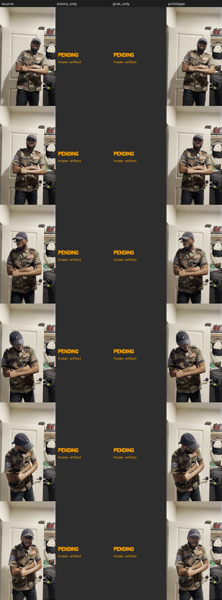

# Warp-worker one-shot QA — `oneshot_2s_arm_cross`

Prototype gated-propagation result scored against the LOCKED §7 kill criterion.

## Reproducibility

| key | value |
|---|---|
| anchors_provided | [] |
| base_provided | False |
| brand_asset | synthetic |
| cadence_frames | 18 |
| detail_authority | grok |
| flow_engine | opencv-dis-medium |
| geometry_authority | kolors |
| masks_provided | [] |
| shot_id | oneshot_2s_arm_cross |
| source_dir | /Volumes/T7/AVT VIDEO CLIPS/benchmark/wardrobe-swap-v1/frames |
| source_index_count | 120 |
| source_index_start | 48 |
| source_index_stride | 1 |
| transfer_mode | gated_flow_propagation_prototype |
| work_width | 480 |
| worker_version | 0.1.0-prototype |

## Metrics

| metric | value | target | verdict |
|---|---|---|---|
| identity_drift_outside (mean |Δ| outside garment) | 0.022 | < 1.5 | ✅ |
| flicker_ratio (garment Δt output/source) | 0.955 | < 1.35 | ✅ |
| &nbsp;&nbsp;flicker_output | 5.881 | — | |
| &nbsp;&nbsp;flicker_source | 6.157 | — | |
| edge_halo (band outside mask) | 0.328 | < 6.0 | ✅ |
| stripe_width_cv (does the stripe swim) | 0.0257 | < 0.08 | ✅ |
| garment_coverage (mean mask area) | 0.239 | sanity | |
| propagation_residual mean (anchor-warp vs truth, garment) | 3.31 | — | |
| propagation_residual **max** | 7.71 | < 60 | ✅ |
| re-anchors flagged by gate | 0 | — | |

## Side-by-side

Columns: source=present, kolors_only=PENDING, grok_only=PENDING, prototype=present

## Honest read

- identity_drift_outside is the fidelity of compositing OUTSIDE the garment region back onto the original footage; near-zero confirms identity/pose/scene are the genuine source (capability #8).
- flicker_ratio=0.96: propagation adds little shimmer beyond the real motion on this window.
- propagation_residual max=7.7 / mean=3.3 gray levels: this is how far the anchor-warped garment drifts from the TRUE frame inside the garment mask. It is the CUMULATIVE trust signal — per-step (adjacent-frame) flow confidence stays ~0.95 even under occlusion because 60fps motion is sub-pixel, so the second-pass gate keys off this residual, not per-step flow. Frames where it exceeds the scale are flagged for re-anchor.
- The garment masks here are the COARSE heuristic prototype masks (SAM plugs in via --mask-dir-json); garment-region numbers inherit that coarseness. hands_arms is a real YCrCb skin mask so the occlusion test is meaningful.
- kolors_only / grok_only side-by-side columns are PENDING the frozen baseline artifacts (separate preflight/upload deploy). Drop those frame dirs in via --base and the anchors JSON to populate them; the machinery already consumes them.
