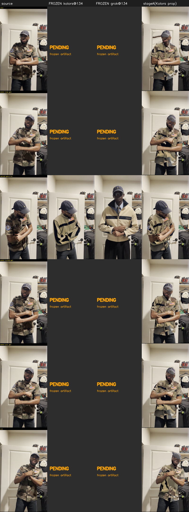

# STAGE A — HARD GATE

**Question (Stage A only):** does the machinery remain stable on ACTUAL Kolors output (no regression)?

> **OVERALL: STAGE A DOES NOT PASS — required inputs (per-frame Kolors base, SAM masks) are BLOCKED and the runnable single-anchor substitute exhibits a severe beyond-reach garment failure. Do NOT introduce Grok / proceed to Stage B until the real per-frame Kolors base + SAM masks are wired.**

## Two independent verdicts (never averaged)

- **Temporal:** FAIL
- **Garment-fidelity:** DEFERRED — Stage A introduces no Grok; baseline garment-fidelity numbers recorded (this is the Kolors-only floor Stage B must beat).

## Controlled head-to-head (Kolors anchor vs source-stand-in anchor)

Identical window, masks, single-anchor structure — only the anchor CONTENT differs, so the delta isolates the Kolors effect (single-anchor decay is common-mode and cancels).

Window 74..194, anchor frame 134, single-anchor reach ±15 frames.

| metric (within reach) | Kolors | source-anchor | regression |
|---|---|---|---|
| flicker | 6.831 | 4.917 | +39% (tol ±15%) |
| edge_halo | 0.762 | 0.39 | +95% (tol ±15%) |
| identity_drift_outside | 0.052 | 0.027 | +93% (tol ±15%) |

## Severe failures (NOT averaged away)

- ❌ single-anchor reach only ±15 of ±60 frames — garment smears badly beyond it (worst flicker frame #83=13.8)

**Worst garment-flicker frame:** local #83 (source #157), value 13.8. See grid.

## Garment-fidelity scorecard (NEW benchmark axis)

| component | value | notes |
|---|---|---|
| stripe_width_variance (CV) | 0.1182 | auto; lower=steadier thickness |
| stripe_position_variance (std, norm) | 0.045 | auto; lower=less swim |
| stripe_x_variance (std, norm) | 0.0331 | auto |
| stripe_presence_rate | 1.0 | auto |
| logo_alignment | None | SEMI-MANUAL: mark logo centroid in N sampled frames; report std of (logo_centroid - stripe_centroid) normalised by torso width. |
| logo_legibility | None | SEMI-MANUAL: local RMS contrast / Laplacian variance in a fixed logo box; higher = sharper, less smeared. |
| zipper_alignment | None | SEMI-MANUAL: fit a line to the central vertical seam; report max lateral deviation (px, normalised by torso width). |
| collar_geometry | None | SEMI-MANUAL: mark collar top corners in N frames; report variance of collar width + tilt. |

Frozen Kolors@134 stripe (baseline floor): width_norm=0.4811, cy_norm=0.4563.

These are the Kolors-only fidelity floor; Stage B must MEASURABLY beat them.

## Frozen-baseline grid (literal artifacts, non-negotiable #2)

Columns: source · FROZEN kolors@134 · FROZEN grok@134 · stageA(Kolors propagated). Frozen columns are the literal `benchmark_frozen_2026-08-01/` artifacts (real only at frame 134).

## Blocked inputs (with compute path)

- ⛔ real per-frame Kolors base — frozen set has ONE Kolors frame (134); needs Kolors VTON per-frame via Fal fal-ai/kling/v1-5/kolors-virtual-try-on (edge/Fal deploy). WITHOUT it, whole-clip Stage A cannot be run and single-anchor reach caps stable coverage at ±15 frames.
- ⛔ real SAM-3 masks — none frozen; needs sam3-segment-proxy / fal-ai/sam-3/video. Garment/sleeve/collar boundaries here are COARSE heuristic; occlusion-correctness + edge-crawl claims inherit that.
