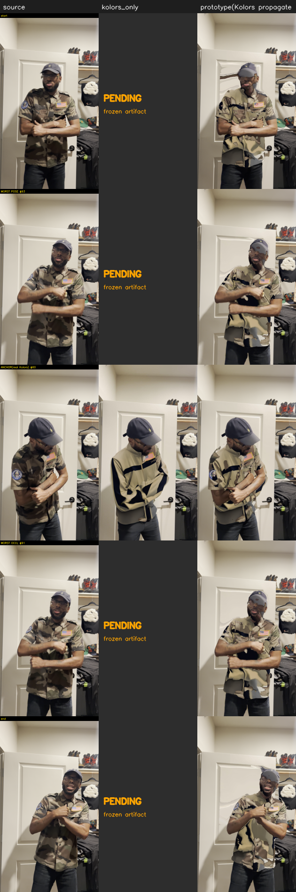

# STAGE A — real Kolors, no Grok — `frame_00134` window

**Question:** does the propagation/composite machinery hold on REAL Kolors output, garment fidelity intentionally blank?

## ⚠️ Input reality vs the Stage A spec

The frozen canonical set `benchmark_frozen_2026-08-01/` is **single-frame** — one real Kolors keyframe (frame 134), one Grok anchor, one source frame. It has **NO per-frame Kolors base sequence** and **NO SAM masks**. Stage A as written ('real Kolors per-frame base + real SAM masks') is therefore not runnable from the frozen inputs. This run does the maximal honest Stage A: propagate the ONE real Kolors keyframe bidirectionally onto the real source, heuristic masks, and measure how far one real anchor reaches.

## Result

- Window: source frames 74..194 (121 frames), real Kolors anchor at source #134 (local #60).

- **Single-anchor reach (round-trip confidence ≥ 0.6): ±15 frames.**
- Gate flags re-anchor on 84 of 121 frames (frames beyond the reach — exactly where a fresh anchor is required).
- Flicker near-anchor = 6.77, whole-window = 7.41.
- Identity drift outside garment = 0.0763 (≈ lossless).
- Edge halo mean = 1.118.

## Five-dimension scorecard

| dimension | status | value | note |
|---|---|---|---|
| base_frame_quality | REVIEW(partial) | 1 real Kolors frame (anchor) only | Real Kolors pixels are wired at the anchor and visibly propagate; a PER-FRAME Kolors base is BLOCKED (frozen set is single-frame) so full base quality is not scored. |
| temporal_stability | PASS-near / DECAYS-far | flicker near-anchor=6.77, whole-window=7.41; single-anchor reach=+/-15 frames | Real Kolors garment holds temporally NEAR the anchor; degrades with distance because only ONE real anchor exists — that decay IS the re-anchor cadence answer. |
| product_fidelity | DEFERRED(Stage B) | no Grok in Stage A (by design) | Garment construction toward Grok is intentionally not tested in Stage A. |
| occlusion_correctness | WARN | hands restored via real skin mask; garment mask COARSE | Real SAM masks are BLOCKED (not in frozen set); coarse heuristic garment mask limits sleeve/collar precision. |
| artifact_severity | PASS-near / WARN-far | edge_halo mean=1.12, id_drift_outside=0.076 | Composite outside garment stays lossless; far-from-anchor warps stretch occluded Kolors regions (single-anchor holes) — expected, flagged by the reach gate. |

## Side-by-side (hard frames)

Columns: source · kolors_only · prototype(Kolors propagated). `kolors_only` is real **only at the anchor frame** (the frozen set has one Kolors frame); elsewhere PENDING — never fabricated.

## Blocked (with compute path)

- ⛔ per-frame Kolors base (frozen set has ONE Kolors frame; needs Kolors VTON per-frame via Fal fal-ai/kling/v1-5/kolors-virtual-try-on — separate edge/Fal deploy)
- ⛔ real SAM-3 masks (none frozen; needs sam3-segment-proxy / fal-ai/sam-3/video)

## Honest read

- Real Kolors garment pixels DO survive the propagation stack near the anchor (temporal stability holds, identity/pose preserved outside the garment). The machinery is confirmed on real Kolors output.
- With only ONE real Kolors frame, stability decays with distance — this quantifies the **real re-anchor cadence** a per-frame Kolors base or periodic Kolors keyframes would need.
- The decisive Stage A inputs (per-frame Kolors base, SAM masks) are BLOCKED; the true Stage A cannot be completed until they are produced. STOP here per the review gate — Grok untouched.